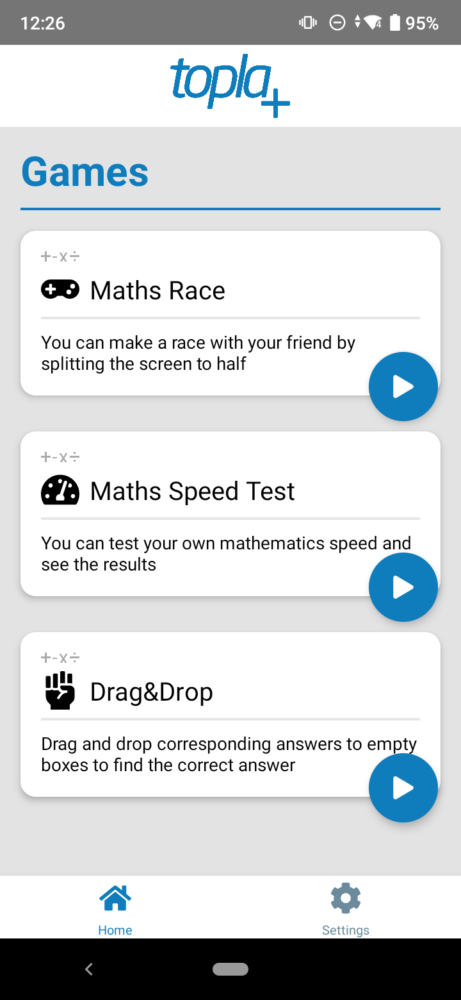
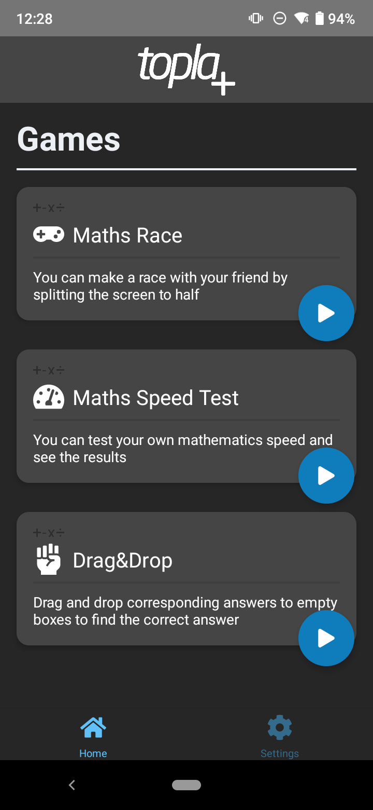
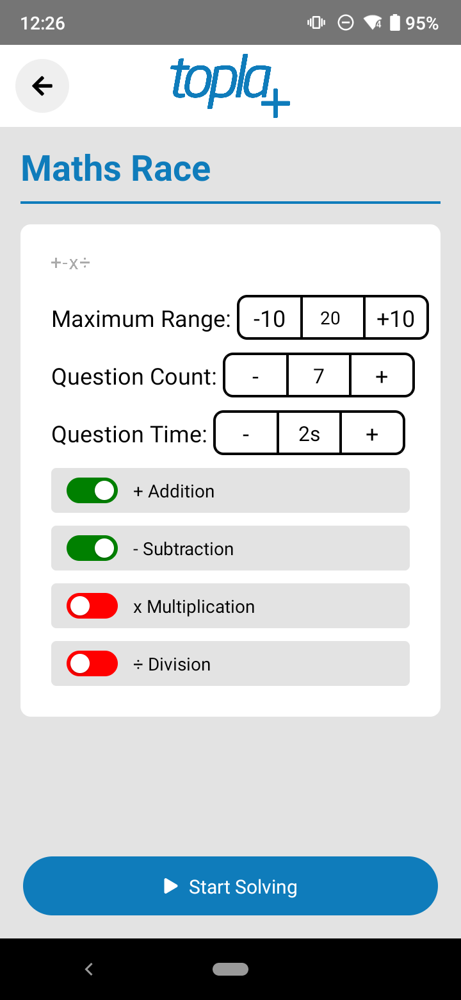
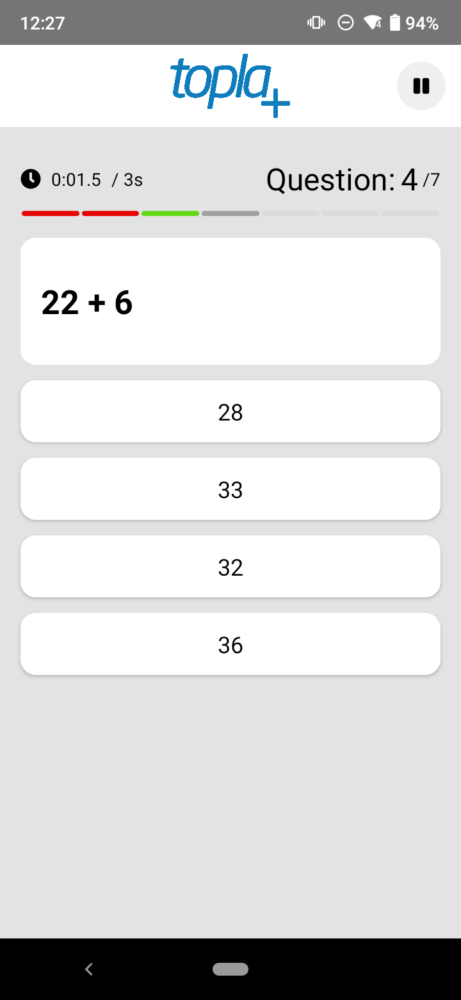
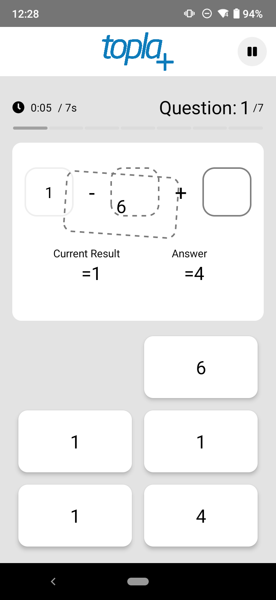
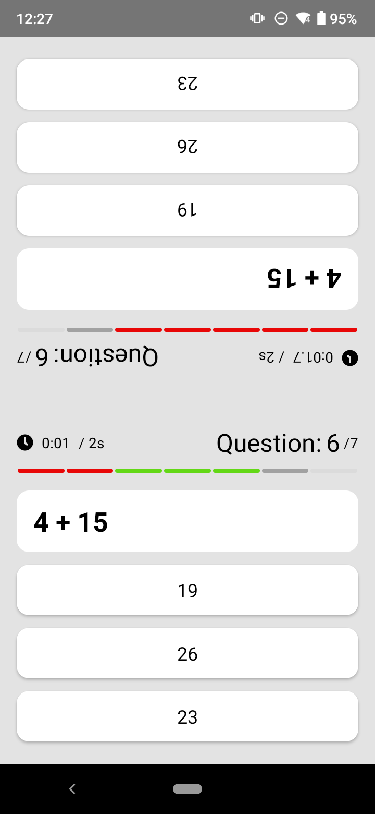

  
  
  

  
  
  

---

# Topla - Speed Test Game

## Topla is an Android app, main target is for practicing basic algebra, made for primary&high school students. You can challenge yourself in this app too, to see how fast you can calculate!

### Repo Links

- [Topla Adobe XD Design Files](./design/ui)
- [Topla React Native Application Frontend](./topla)
- [Topla Node.js Application Backend](./topla-server)
- [Compare UI design and real application](./design/ui/comparing_design)

### Important notes for React Native part

- First, download all packages using 'npm'
- Goto directory /node_modules/react-native-admob/android/src/main/java/com/sbugert/rnadmob/RNAdMobRewardedVideoAdModule.java
- Comment out line 95, change "sendEvent(EVENT_VIDEO_COMPLETED, null);" to "// sendEvent(EVENT_VIDEO_COMPLETED, null);"
- Use test ad keys for AdMob or use your own in .env file
- Make sure to change settings and rename .env_template to .env in directory /topla
- Make sure to change settings and rename keys_template.js to keys.js in root directory
- Please contact to erenkulaksz@gmail.com for build/test release problems

### Topla uygulaması sayesinde matematik işlemlerinde hızınızı arttırabilir, kendinize meydan okuyabilirsiniz.

## Özellikler:

### Dil Seçenekleri:

- İngilizce
- Türkçe

### Oyun Modları:

- Maths Race -> Ekran ikiye bölünür ve karşınızdaki kişi ile yarışabilirsiniz
- Maths Speed Test -> Kendi matematik hızınızı bu mod ile ölçebilirsiniz
- Drag&Drop -> İşlemi tamamlamak için doğru sayıları sürükleyip bırakmanız gerekmektedir

### Seçilebilir Basamak Aralığı:

- Karanlık mod desteği
- 1 basamaklıdan 4 basamaklıya.
- Sorular tamamen rastgele üretilir.
- Soruların içeriğini tamamen kendiniz ayarlayabilir veya önceden ayarlanmış zorluklara göre çözebilirsiniz.
- Soruların seçenekleri dinamik ve cevaba göre üretilir.
- Bölme ve çıkarma için ayrı alogritma kullanılır.

# Roadmap

- ToplaGold
- Operator Challenge
- Design Remake

---

# [Changelog](https://sites.google.com/view/topla-changelog/ana-sayfa)

- [Uygulamada yapilan degisiklikleri buradan goruntuleyebilirsiniz](https://sites.google.com/view/topla-changelog/ana-sayfa)
